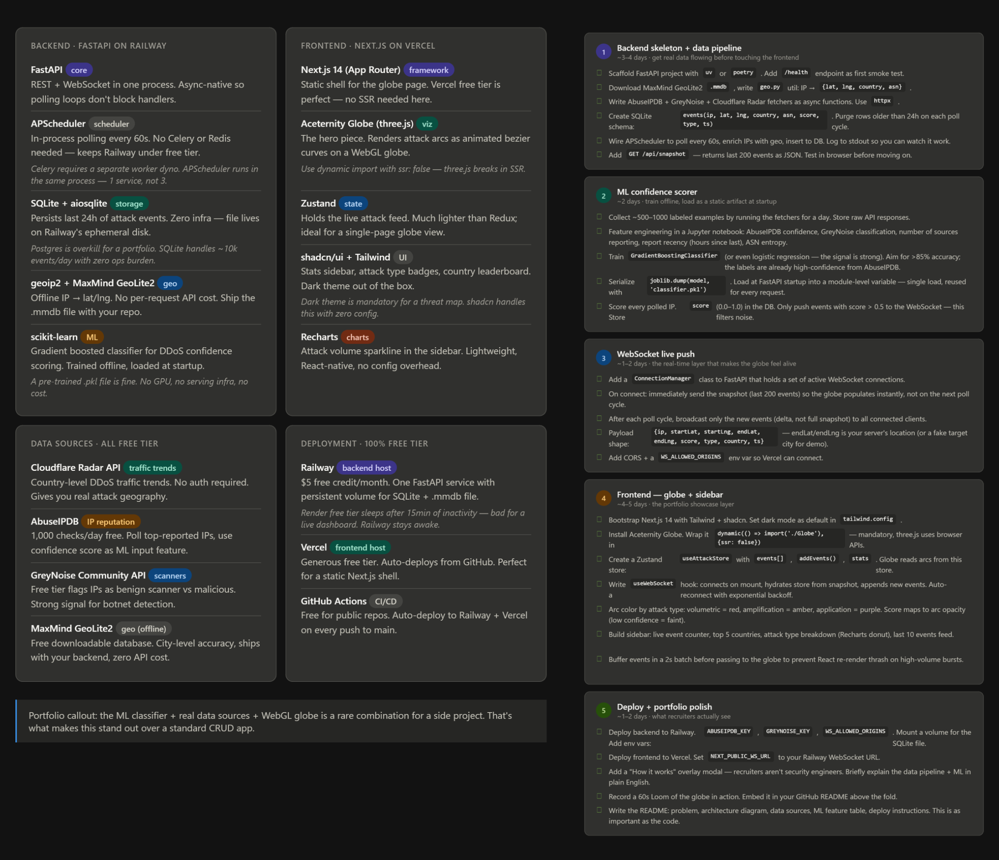

# Live DDoS Map

A real-time DDoS attack visualization dashboard that displays high-risk internet attack signals as animated markers on a 3D WebGL globe. This project demonstrates a complete data pipeline combining threat intelligence aggregation, geolocation enrichment, ML confidence scoring, WebSocket streaming, and interactive visualization.



## Overview

Live DDoS Map is a portfolio-grade demonstration of a threat operations dashboard. It polls public threat intelligence sources, normalizes and enriches attack signals with geolocation data, scores events using a lightweight ML classifier, and broadcasts live updates to a Next.js frontend displaying an interactive 3D globe.

**This is not a production SIEM or authoritative attribution system.** It is an engineering showcase combining data ingestion, geolocation, ML scoring, real-time WebSockets, and WebGL visualization.

### Live Demo

- **Frontend**: [Deploy to Vercel]
- **Backend API**: [Deploy to Railway]

## Features

- **Real-time Attack Visualization**: Live 3D globe showing attack sources with animated markers
- **Multi-Source Threat Intelligence**: Aggregates data from Cloudflare Radar, AbuseIPDB, and GreyNoise
- **ML Confidence Scoring**: Gradient boosting classifier assigns DDoS confidence scores (0.0-1.0)
- **Geolocation Enrichment**: Offline IP geolocation using MaxMind GeoLite2
- **WebSocket Live Push**: Initial snapshot + delta updates every 60 seconds
- **Analytics Dashboard**: Country rankings, attack type breakdown, recent events feed
- **Rolling 24-Hour Window**: SQLite stores events with automatic pruning
- **Single-Process Backend**: No Redis, Celery, or Kafka required
- **Free-Tier Hosting**: Designed for Railway (backend) and Vercel (frontend)

## Architecture

### Technology Stack

**Backend:**
- FastAPI with async/await
- SQLite + aiosqlite for persistence
- APScheduler for periodic polling
- MaxMind GeoLite2 for geolocation
- scikit-learn for ML scoring
- httpx for async HTTP calls
- WebSocket for real-time push

**Frontend:**
- Next.js 14 with App Router
- TypeScript
- Zustand for state management
- COBE for 3D globe visualization
- Recharts for analytics
- Tailwind CSS for styling

### Data Flow

1. **Poll**: APScheduler triggers fetchers every 60 seconds
2. **Fetch**: Async calls to Cloudflare Radar, AbuseIPDB, GreyNoise
3. **Normalize**: Convert source-specific responses to common `CandidateEvent` format
4. **Geolocate**: Enrich IPs with lat/lng using MaxMind GeoLite2
5. **Extract Features**: Convert signals to ML feature vector
6. **Score**: ML classifier returns confidence score (0.0-1.0)
7. **Filter**: Events below `MIN_EVENT_SCORE` (default 0.5) are discarded
8. **Store**: Insert accepted events into SQLite
9. **Broadcast**: WebSocket pushes new events to all connected clients
10. **Visualize**: Frontend globe renders markers and analytics

### Runtime Topology

```
┌─────────────────────────────────────────────────┐
│  Frontend (Vercel)                              │
│  ┌──────────────────────────────────────────┐   │
│  │  Next.js Dashboard                       │   │
│  │  - 3D Globe (COBE)                       │   │
│  │  - Zustand Store                         │   │
│  │  - WebSocket Hook                        │   │
│  │  - Analytics Sidebar                     │   │
│  └──────────────────────────────────────────┘   │
└─────────────────────────────────────────────────┘
           │                           │
           │ GET /api/snapshot         │ WS /ws/attacks
           │                           │
┌──────────┴───────────────────────────┴──────────┐
│  Backend (Railway)                              │
│  ┌──────────────────────────────────────────┐   │
│  │  FastAPI App                             │   │
│  │  - ConnectionManager (WebSocket)         │   │
│  │  - APScheduler (poll loop)               │   │
│  │  - AttackPoller                          │   │
│  │  - SQLite (aiosqlite)                    │   │
│  │  - ML Scorer (joblib)                    │   │
│  └──────────────────────────────────────────┘   │
│  ┌──────────────────────────────────────────┐   │
│  │  Services                                │   │
│  │  - Cloudflare Radar Fetcher              │   │
│  │  - AbuseIPDB Fetcher                     │   │
│  │  - GreyNoise Fetcher                     │   │
│  │  - Geolocation (MaxMind)                 │   │
│  │  - Feature Extractor                     │   │
│  │  - Normalizer                            │   │
│  └──────────────────────────────────────────┘   │
│  ┌──────────────────────────────────────────┐   │
│  │  Persistent Volume                       │   │
│  │  - events.db (SQLite)                    │   │
│  │  - GeoLite2-City.mmdb                    │   │
│  └──────────────────────────────────────────┘   │
└─────────────────────────────────────────────────┘
```

## Getting Started

### Prerequisites

- Python 3.11+
- Node.js 18+
- MaxMind GeoLite2 database (see setup below)
- API keys for AbuseIPDB and GreyNoise (optional for development)

### Backend Setup

1. **Navigate to backend directory:**

```bash
cd backend
```

2. **Install dependencies:**

```bash
pip install -e ".[dev]"
```

3. **Download MaxMind GeoLite2 Database:**

Sign up for a free account at [MaxMind](https://dev.maxmind.com/geoip/geolite2-free-geolocation-data) and download `GeoLite2-City.mmdb`. Place it in a known location (e.g., `backend/data/GeoLite2-City.mmdb`).

4. **Configure environment variables:**

Copy `.env.example` to `.env` and configure:

```bash
DDOS_DB_PATH=backend/data/events.db
MAXMIND_DB_PATH=backend/data/GeoLite2-City.mmdb
ABUSEIPDB_KEY=your_key_here
GREYNOISE_KEY=your_key_here
WS_ALLOWED_ORIGINS=http://localhost:3000
POLL_INTERVAL_SECONDS=60
EVENT_TTL_HOURS=24
MIN_EVENT_SCORE=0.5
MODEL_PATH=backend/app/ml/model.joblib
ENABLE_HEURISTIC_SCORER=true
ENABLE_SCHEDULER=true
SOURCE_TIMEOUT_SECONDS=10
ABUSEIPDB_BLACKLIST_LIMIT=50
GREYNOISE_LOOKUP_LIMIT=25
TARGET_LAT=37.7749
TARGET_LNG=-122.4194
LOG_LEVEL=INFO
```

5. **Run the backend:**

```bash
uvicorn app.main:app --reload --host 0.0.0.0 --port 8000
```

The backend will be available at `http://localhost:8000`.

6. **Verify backend health:**

```bash
curl http://localhost:8000/health
```

### Frontend Setup

1. **Navigate to frontend directory:**

```bash
cd frontend
```

2. **Install dependencies:**

```bash
npm install
```

3. **Configure environment variables:**

Create `.env.local`:

```bash
NEXT_PUBLIC_API_URL=http://localhost:8000
NEXT_PUBLIC_WS_URL=ws://localhost:8000/ws/attacks
```

4. **Run the development server:**

```bash
npm run dev
```

The frontend will be available at `http://localhost:3000`.

5. **Build for production:**

```bash
npm run build
npm start
```

## Data Sources

### Cloudflare Radar

Provides country-level traffic trends and DDoS activity signals. Used as aggregate geography and trend indicators. Does not provide per-IP data.

- **API**: Public REST API (no key required)
- **Rate Limits**: Generous for aggregate queries
- **Data Freshness**: Near real-time trends

### AbuseIPDB

Community-driven IP reputation database reporting malicious activity including DDoS attacks, scanners, and botnets.

- **API**: Requires free API key
- **Rate Limits**: 1,000 requests/day (free tier)
- **Data Type**: Per-IP abuse reports with confidence scores

### GreyNoise

Intelligence on internet-wide scanning and attack activity, classifying IPs as malicious, benign, or unknown.

- **API**: Requires free API key
- **Rate Limits**: 10,000 requests/month (community tier)
- **Data Type**: Per-IP classification with tags

### MaxMind GeoLite2

Offline IP geolocation database providing city-level latitude/longitude coordinates.

- **Database**: Free download with account
- **Accuracy**: ~90% country-level, ~80% city-level
- **Updates**: Monthly updates recommended
- **License**: Requires attribution, cannot redistribute

## ML Confidence Scoring

### Model Architecture

The confidence scorer uses a **Gradient Boosting Classifier** trained on synthetic and labeled threat intelligence data. The model predicts the probability that a candidate event represents legitimate DDoS-relevant activity.

**This is a confidence score, not proof of attack.** The UI and documentation use confidence language, not certainty language.

### Feature Engineering

The model uses the following features extracted from candidate events:

1. **AbuseIPDB Confidence Score** (0-100)
2. **GreyNoise Classification** (malicious=1, benign=0, unknown=0.5)
3. **Source Agreement Count** (1-3 sources)
4. **Cloudflare DDoS Trend Intensity** (0-1)
5. **ASN Reputation Score** (heuristic-based)
6. **IP Routability** (public=1, private/reserved=0)
7. **Event Freshness** (minutes since observation)
8. **Attack Type Hint** (one-hot encoded)

Feature extraction is defined in `backend/app/services/features.py` and mirrors the contract in `backend/app/ml/features.json`.

### Training

The initial model is trained using synthetic data generated by `backend/scripts/train_model.py`. For production use, replace with real labeled examples collected via `backend/scripts/collect_training_data.py`.

**Model artifacts:**
- `backend/app/ml/model.joblib` - Serialized scikit-learn model
- `backend/app/ml/features.json` - Feature names and preprocessing metadata
- `backend/app/ml/metrics.json` - Training/validation performance metrics

### Heuristic Fallback

If the ML model is unavailable, the backend can use a deterministic heuristic scorer:

- High AbuseIPDB score → higher confidence
- Malicious GreyNoise classification → higher confidence
- Multiple source agreement → higher confidence
- Recent Cloudflare DDoS trend → higher confidence

Enable with `ENABLE_HEURISTIC_SCORER=true` in development.

## API Reference

### `GET /health`

Health check endpoint.

**Response:**
```json
{
  "status": "ok",
  "service": "live-ddos-map-backend"
}
```

### `GET /api/snapshot`

Returns recent attack events.

**Query Parameters:**
- `limit` (optional): Max events to return (default: 200, max: 500)

**Response:**
```json
{
  "events": [
    {
      "id": 123,
      "ip": "203.0.113.10",
      "startLat": 35.6895,
      "startLng": 139.6917,
      "endLat": 37.7749,
      "endLng": -122.4194,
      "country": "Japan",
      "countryCode": "JP",
      "asn": "AS64500",
      "score": 0.84,
      "type": "volumetric",
      "source": "combined",
      "ts": "2026-06-27T12:00:00Z"
    }
  ]
}
```

### `WS /ws/attacks`

WebSocket endpoint for real-time event streaming.

**Initial Snapshot:**
```json
{
  "kind": "snapshot",
  "events": [...]
}
```

**Live Deltas:**
```json
{
  "kind": "events",
  "events": [...]
}
```

**Heartbeat (Optional):**
```json
{
  "kind": "heartbeat",
  "ts": "2026-06-27T12:00:00Z"
}
```

## Deployment

### Backend Deployment (Railway)

1. **Create a new Railway project** and connect your GitHub repository.

2. **Add a persistent volume** for SQLite and MaxMind database:
   - Mount path: `/data`
   - Size: 1GB (sufficient for 24-hour rolling window)

3. **Configure environment variables:**

```bash
DDOS_DB_PATH=/data/events.db
MAXMIND_DB_PATH=/data/GeoLite2-City.mmdb
ABUSEIPDB_KEY=your_production_key
GREYNOISE_KEY=your_production_key
WS_ALLOWED_ORIGINS=https://your-frontend.vercel.app,http://localhost:3000
POLL_INTERVAL_SECONDS=60
EVENT_TTL_HOURS=24
MIN_EVENT_SCORE=0.5
MODEL_PATH=backend/app/ml/model.joblib
ENABLE_HEURISTIC_SCORER=false
ENABLE_SCHEDULER=true
SOURCE_TIMEOUT_SECONDS=10
TARGET_LAT=37.7749
TARGET_LNG=-122.4194
LOG_LEVEL=INFO
```

4. **Upload MaxMind database** to the persistent volume via Railway CLI or manual upload.

5. **Deploy** from the `backend` directory with start command:

```bash
uvicorn app.main:app --host 0.0.0.0 --port $PORT
```

### Frontend Deployment (Vercel)

1. **Connect your GitHub repository** to Vercel.

2. **Configure root directory**: Set to `frontend`.

3. **Configure environment variables:**

```bash
NEXT_PUBLIC_API_URL=https://your-backend.railway.app
NEXT_PUBLIC_WS_URL=wss://your-backend.railway.app/ws/attacks
```

4. **Deploy** automatically on push to main branch.

5. **Verify WebSocket connection** works across Railway and Vercel.

### CI/CD Setup

Create `.github/workflows/ci.yml`:

```yaml
name: CI

on: [push, pull_request]

jobs:
  backend-tests:
    runs-on: ubuntu-latest
    steps:
      - uses: actions/checkout@v4
      - uses: actions/setup-python@v5
        with:
          python-version: '3.11'
      - name: Install dependencies
        run: |
          cd backend
          pip install -e ".[dev]"
      - name: Run tests
        run: |
          cd backend
          pytest
        env:
          ENABLE_SCHEDULER: false

  frontend-build:
    runs-on: ubuntu-latest
    steps:
      - uses: actions/checkout@v4
      - uses: actions/setup-node@v4
        with:
          node-version: '18'
      - name: Install dependencies
        run: |
          cd frontend
          npm install
      - name: Build
        run: |
          cd frontend
          npm run build
        env:
          NEXT_PUBLIC_API_URL: http://localhost:8000
          NEXT_PUBLIC_WS_URL: ws://localhost:8000/ws/attacks
```

## Testing

### Backend Tests

Run unit and integration tests:

```bash
cd backend
pytest
```

Run with coverage:

```bash
pytest --cov=app --cov-report=html
```

Test files:
- `tests/test_health.py` - Health endpoint
- `tests/test_snapshot.py` - Snapshot API
- `tests/test_normalizer.py` - Source normalization
- `tests/test_features.py` - Feature extraction
- `tests/test_scorer.py` - ML scorer
- `tests/test_websocket.py` - WebSocket protocol

### Frontend Build

Type check and build:

```bash
cd frontend
npm run build
npm run lint
```

### Manual WebSocket Test

Test WebSocket connection with the backend running:

```bash
cd backend
python scripts/test_websocket_manual.py
```

## Known Limitations

### Data Quality
- **Confidence scores are probabilistic**: Events represent likely attack signals, not confirmed incidents
- **Aggregate signals**: Cloudflare Radar provides country-level trends, not per-IP attribution
- **Rate limits**: Free-tier API keys limit polling frequency and coverage
- **Geolocation accuracy**: MaxMind GeoLite2 has ~80% city-level accuracy

### Infrastructure
- **Single-process backend**: No horizontal scaling without architectural changes
- **SQLite limitations**: Not suitable for write-heavy workloads beyond 60-second polls
- **24-hour window**: No long-term historical analysis
- **Ephemeral risk**: Railway persistent volumes must be properly configured

### Visualization
- **No arc animations**: Globe shows markers only (future enhancement)
- **Performance cap**: Maximum 500 events in memory, 100 markers on globe
- **WebGL required**: Browser must support WebGL for globe rendering

### Security
- **No authentication**: Public dashboard with no access controls
- **Origin validation only**: WebSocket uses origin checking, not token-based auth
- **API key exposure risk**: Backend must secure environment variables

## Troubleshooting

### Backend Issues

**"MaxMind database not found"**
- Verify `MAXMIND_DB_PATH` points to valid `.mmdb` file
- Download from MaxMind website with free account
- Check file permissions in Railway persistent volume

**"Source fetcher timeout"**
- Increase `SOURCE_TIMEOUT_SECONDS` (default: 10)
- Check API key validity
- Verify network connectivity to external APIs

**"No events appearing"**
- Check `MIN_EVENT_SCORE` threshold (default: 0.5)
- Verify scheduler is enabled: `ENABLE_SCHEDULER=true`
- Review logs for source fetcher errors
- Confirm API keys are valid and not rate-limited

**"WebSocket connection refused"**
- Verify `WS_ALLOWED_ORIGINS` includes frontend URL
- Check CORS and WebSocket headers
- Test with `scripts/test_websocket_manual.py`

### Frontend Issues

**"Globe not rendering"**
- Check browser WebGL support
- Verify COBE library loaded correctly
- Check console for dynamic import errors

**"No events showing on dashboard"**
- Verify backend WebSocket URL is correct
- Check browser console for connection errors
- Confirm backend is running and accessible
- Test `GET /api/snapshot` endpoint directly

**"Connection status stuck on 'connecting'"**
- Backend may not be running
- WebSocket URL may be incorrect (ws:// vs wss://)
- Origin may be blocked by backend CORS settings

## Performance Optimization

### Backend
- Use async HTTP calls with `httpx`
- Set timeouts for all external API calls
- Deduplicate events within poll cycles
- Purge old SQLite rows after each poll
- Index SQLite on `ts`, `score`, and `country_code`

### Frontend
- Cap events in memory at 500
- Deduplicate by event ID
- Batch incoming events before globe updates
- Dynamic import globe with SSR disabled
- Limit globe markers to 100 for performance

## Contributing

This is a portfolio project. Contributions, issues, and feature requests are welcome for educational purposes.

## License

MIT License - see LICENSE file for details.

## Acknowledgments

- **Cloudflare Radar** for public threat intelligence API
- **AbuseIPDB** for community-driven IP reputation data
- **GreyNoise** for internet-wide scanning intelligence
- **MaxMind** for GeoLite2 geolocation database
- **COBE** for beautiful WebGL globe visualization
- Inspired by threat operations dashboards and real-time security visualization tools

## Contact

For questions, suggestions, or opportunities, please open an issue or reach out via GitHub.

---

**Remember**: This dashboard shows confidence-scored attack signals from public sources. It is not a production SIEM and does not constitute authoritative attribution of DDoS attacks. Use it to understand threat intelligence pipelines, ML scoring, real-time visualization, and modern web architectures.
