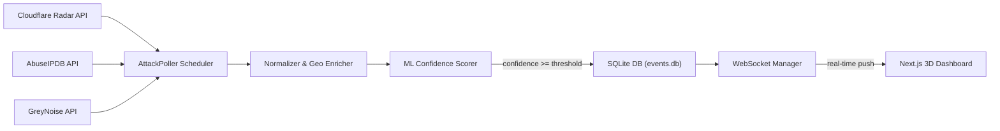
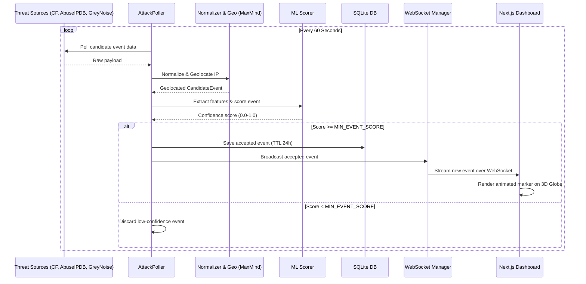
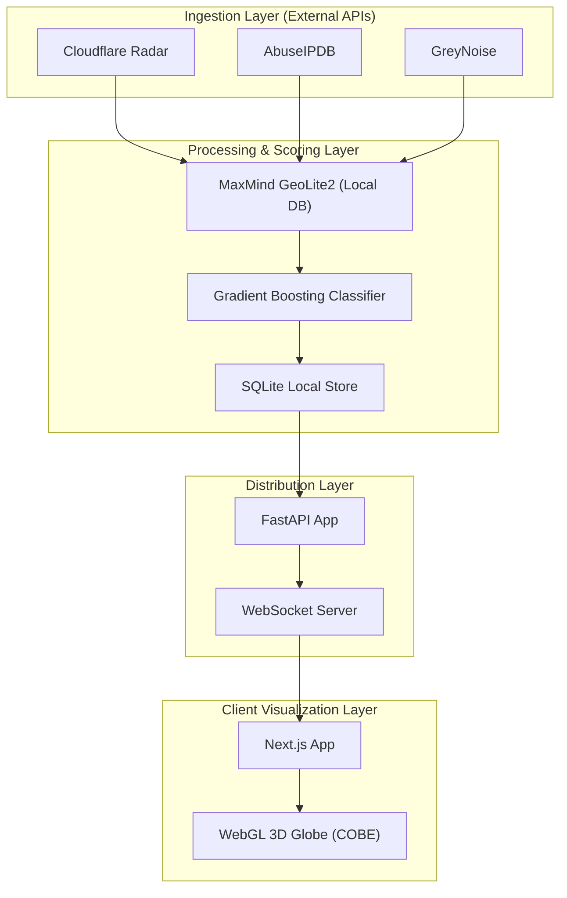

# Live DDoS Map

Live DDoS Map is a real-time DDoS attack visualization dashboard that displays high-risk internet attack signals as animated markers on a 3D WebGL globe. The project demonstrates a complete data pipeline combining threat intelligence aggregation, geolocation enrichment, ML confidence scoring, WebSocket streaming, and interactive web visualization.

The project is built around one principle: threat intelligence should be observable, scored, and visualized in real time.

## Why This Exists

Security operations teams require high-fidelity, real-time visibility into incoming threats. However, raw threat feeds are often noisy, distributed across multiple proprietary or public APIs, and lack consistent confidence estimation. 

Live DDoS Map changes the ingestion and analysis model. Instead of presenting disjointed and raw IP lists, the system aggregates multiple open-source feeds (Cloudflare Radar, AbuseIPDB, and GreyNoise), geolocates candidate IPs offline using MaxMind GeoLite2, and applies a Gradient Boosting Classifier to score and filter out low-confidence signals before broadcasting the results to an interactive 3D WebGL globe.

This gives the system three practical security properties:

- **Aggregated Intelligence**: Combines global telemetry (Cloudflare Radar) with IP reputation (AbuseIPDB) and honeypot/scanner activity (GreyNoise).
- **ML Confidence Scoring**: A machine learning model filters out low-confidence events before they reach the operator.
- **Low-Latency Streaming**: An active WebSocket connection pushes events and snapshot updates directly to the interactive 3D dashboard.

## System Overview



The core backend is designed to be lightweight, single-process, and asynchronous. Most surrounding code exists to make the threat data pipeline visible, testable, and easy to run from local development through production.

## Ingestion & Scoring Lifecycle



The system recognizes three states for ingestion records:

- `Candidate`: A raw event fetched from a threat intelligence source.
- `Accepted`: An event whose ML confidence score meets or exceeds `MIN_EVENT_SCORE`, stored in SQLite and streamed to the frontend.
- `Discarded`: An event that fell below the score threshold and was ignored.

## Pipeline Components

The core application lives under [backend/app](file:///C:/projects/live-ddos-map/backend/app).

Key roles & components:
- `FastAPI application` ([backend/app/main.py](file:///C:/projects/live-ddos-map/backend/app/main.py)): Coordinates HTTP REST endpoints and the WebSocket connection.
- `scheduler` ([backend/app/scheduler.py](file:///C:/projects/live-ddos-map/backend/app/scheduler.py)): Periodic job scheduler (APScheduler) triggering polling routines.
- `database` ([backend/app/db.py](file:///C:/projects/live-ddos-map/backend/app/db.py)): Manages asynchronous connections to the local SQLite database.
- `connection manager` ([backend/app/connection_manager.py](file:///C:/projects/live-ddos-map/backend/app/connection_manager.py)): Manages active WebSockets and handles broadcasting to active clients.
- `config` ([backend/app/config.py](file:///C:/projects/live-ddos-map/backend/app/config.py)): Handles environment variable definitions and defaults.

Core services:
- `fetchers`: fetch raw signals from [Cloudflare Radar](file:///C:/projects/live-ddos-map/backend/app/services/fetch_cloudflare.py), [AbuseIPDB](file:///C:/projects/live-ddos-map/backend/app/services/fetch_abuseipdb.py), and [GreyNoise](file:///C:/projects/live-ddos-map/backend/app/services/fetch_greynoise.py).
- `normalizer` ([backend/app/services/normalizer.py](file:///C:/projects/live-ddos-map/backend/app/services/normalizer.py)): normalizes raw payloads to a standard schema.
- `geolocation` ([backend/app/services/geo.py](file:///C:/projects/live-ddos-map/backend/app/services/geo.py)): queries the MaxMind offline GeoLite2 database.
- `features` ([backend/app/services/features.py](file:///C:/projects/live-ddos-map/backend/app/services/features.py)): extracts model features from candidate events.
- `scorer` ([backend/app/services/scorer.py](file:///C:/projects/live-ddos-map/backend/app/services/scorer.py)): classifies and scores the events with scikit-learn.

## Trust Boundaries



The system ingests raw untrusted threat intelligence data. Geolocation, ML feature extraction, and ML scoring act as security boundaries to prevent noise and bad telemetry from reaching the persistence layer (SQLite) and active visualization dashboards.

## Repository Layout

- [backend](file:///C:/projects/live-ddos-map/backend): FastAPI backend, database handling, and ML scoring.
- [frontend](file:///C:/projects/live-ddos-map/frontend): Next.js app with App Router and WebGL Globe dashboard.

Important scripts:
- [train_model.py](file:///C:/projects/live-ddos-map/backend/scripts/train_model.py): script for training the Gradient Boosting Classifier.
- [collect_training_data.py](file:///C:/projects/live-ddos-map/backend/scripts/collect_training_data.py): script for accumulating threat feeds for training.
- [test_websocket_manual.py](file:///C:/projects/live-ddos-map/backend/scripts/test_websocket_manual.py): terminal script for testing live WebSockets.

## Features

- Real-Time 3D WebGL Globe visualization using COBE
- Multi-source intelligence polling (AbuseIPDB, GreyNoise, Cloudflare Radar)
- Machine Learning (Gradient Boosting Classifier) confidence estimation
- Offline city-level IP geolocation using MaxMind GeoLite2
- SQLite database persistent storage with a rolling 24-hour retention window (automatic pruning)
- Dynamic WebSocket subscription broadcasting snapshot and delta payloads
- Interactive sidebar analytics with country rankings and attack type charts
- Single-process backend architecture, optimizing resource usage

## Local Development

Install dependencies and set up the environment:

### Backend Setup

1. Navigate to the backend directory:
```powershell
cd backend
```

2. Install backend dependencies:
```powershell
pip install -e ".[dev]"
```

3. Download the MaxMind GeoLite2 City database:
   - Sign up for a free account at [MaxMind](https://dev.maxmind.com/geoip/geolite2-free-geolocation-data).
   - Download `GeoLite2-City.mmdb` and place it in the `backend/data` directory (e.g. `backend/data/GeoLite2-City.mmdb`).

4. Copy the environment configuration:
```powershell
copy .env.example .env
```
Ensure variables such as `ABUSEIPDB_KEY` and `GREYNOISE_KEY` are configured.

5. Run the FastAPI development server:
```powershell
uvicorn app.main:app --reload --host 0.0.0.0 --port 8000
```

### Frontend Setup

1. Navigate to the frontend directory:
```powershell
cd ../frontend
```

2. Install frontend dependencies:
```powershell
npm install
```

3. Copy the environment configuration:
```powershell
copy .env.local.example .env.local
```

4. Run the Next.js development server:
```powershell
npm run dev
```

The frontend will be available locally at `http://localhost:3000`.

## ML Confidence Scoring

### Feature Engineering

The confidence scorer translates candidates to feature vectors using:
1. **AbuseIPDB Confidence Score** (0-100)
2. **GreyNoise Classification** (malicious=1, benign=0, unknown=0.5)
3. **Source Agreement Count** (1-3 sources)
4. **Cloudflare DDoS Trend Intensity** (0-1)
5. **ASN Reputation Score** (heuristic-based)
6. **IP Routability** (public=1, private/reserved=0)
7. **Event Freshness** (minutes since observation)
8. **Attack Type Hint** (one-hot encoded)

Feature mappings and preparation are defined in [backend/app/services/features.py](file:///C:/projects/live-ddos-map/backend/app/services/features.py).

### Training Model

To train the model on local training data, run the model training script:
```powershell
python scripts/train_model.py
```
This generates the following artifacts:
- `backend/app/ml/model.joblib` - Serialized scikit-learn model
- `backend/app/ml/features.json` - Feature names and preprocessing metadata
- `backend/app/ml/metrics.json` - Training/validation performance metrics

### Heuristic Fallback

If the ML model is disabled or unavailable, you can use a deterministic fallback scoring mechanism by configuring:
```env
ENABLE_HEURISTIC_SCORER=true
```

## API Reference

### `GET /health`
Returns pipeline health status.

**Response:**
```json
{
  "status": "ok",
  "service": "live-ddos-map-backend"
}
```

### `GET /api/snapshot`
Returns the recent list of attacks from the rolling SQLite window.

**Query Parameters:**
- `limit` (optional): Max events to return (default: 200, max: 500)

**Response:**
```json
{
  "events": [
    {
      "id": 123,
      "ip": "203.0.113.10",
      "startLat": 35.6895,
      "startLng": 139.6917,
      "endLat": 37.7749,
      "endLng": -122.4194,
      "country": "Japan",
      "countryCode": "JP",
      "asn": "AS64500",
      "score": 0.84,
      "type": "volumetric",
      "source": "combined",
      "ts": "2026-07-08T12:00:00Z"
    }
  ]
}
```

### `WS /ws/attacks`
Maintains a WebSocket channel for streaming live events.

**Initial Snapshot Payload:**
```json
{
  "kind": "snapshot",
  "events": [...]
}
```

**Live Delta Payload:**
```json
{
  "kind": "events",
  "events": [...]
}
```

## Public Deployment

### Backend Deployment (Railway)
1. Link your GitHub repository to a new Railway service.
2. Mount a persistent volume at `/data` for the SQLite and MaxMind databases.
3. Configure environment variables in Railway matching `.env.example`.
4. Ensure the start command is configured: `uvicorn app.main:app --host 0.0.0.0 --port $PORT`

### Frontend Deployment (Vercel)
1. Add the project to Vercel and set the root directory to `frontend`.
2. Configure `NEXT_PUBLIC_API_URL` and `NEXT_PUBLIC_WS_URL` to point to the Railway instance.

## Security & Limitations

- **Confidence scores are probabilistic**: Scores estimate the likelihood of active attack behavior; they do not serve as definitive proof.
- **Single-process backend**: SQLite is designed for light workloads and 60-second polling intervals. It is not suitable for high-throughput write workloads.
- **Unauthenticated dashboard**: The visualization dashboard is public and has no access control features.
- **MaxMind GeoLite2 Accuracy**: Free database has ~80% city-level accuracy.

## Verification

Run backend unit and integration tests:
```powershell
pytest
```

Build the frontend to verify compilation:
```powershell
npm run build
```

Run a manual socket subscription validation:
```powershell
python scripts/test_websocket_manual.py
```
